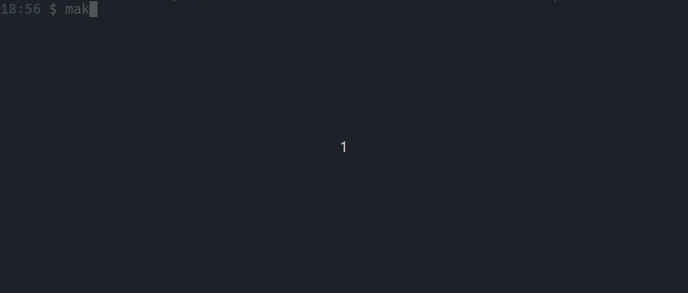

# Mini-projet : Pickomino

- [Mini-projet : Pickomino](#mini-projet--pickomino)
  - [Présentation](#présentation)
  - [Utilisation](#utilisation)
  - [Changelog](#changelog)
  - [TODO](#todo)
  - [Défauts constatés non corrigés](#défauts-constatés-non-corrigés)
  - [Équipe de développement](#équipe-de-développement)

---

## Présentation

Pickomino est un jeux de société créé par Reiner Knizia et édité par Gigamic, qui se joue avec 2 ou 7 joueurs maximum. Le but du jeu est d'avoir plus de vers que ces adversaires pour remporter la partie.
Le jeux est composer de 2 zones de jeux distinctes:

- L'inventaire de chaque joueurs.
- Le plateau de jeu.

#### L'inventaire du joueur

- Stocker les pickominos gagners.
- Echanger les pickominos perdus.

#### Le plateau de jeu

- Brochette de touts les pickominos.
- Les 8 dès de 6 faces.
- Transfert des pickominos vers les joueurs.

#### Déroulement d'une partie

Pour commencer une partie, c'est le joueur le plus jeune qui débute. Le premier joueur lance les 8 dés. Il doit choisir parmi les dés le symbole qui lui convient et mettre de côté tous les dés ayant le même symbole. À chaque lancer, l'action est répétée, sauf qu'il doit choisir un symbole qu'il n'a pas choisi auparavant. :warning: Le joueur doit impérativement mettre de côté au moins un dé avec le symbole « ver » pour valider son tour et récupérer une tuile correspondant à la valeur totale de tous ses dés.

- Face 1 = 1 point
- Face 2 = 2 points
- Face 3 = 3 points
- Face 4 = 4 points
- Face 5 = 5 points
- Face « ver » = 5 points

Si, à l'issue des lancers, le joueur ne peut pas prendre de tuile ou n'a pas obtenu de « ver », il doit remettre sa dernière tuile obtenue dans la brochette sur le plateau de jeu, et la tuile de plus haute valeur est retournée (retirée du jeu).  
La partie se termine quand toutes les tuiles ont été prises. Chaque joueur compte le nombre de vers présents sur l'ensemble de ses tuiles. Le joueur ayant le plus de vers remporte la partie.

### Utilisation

```bash
$ make

$ ./pickomino.out
```



## Changelog

## TODO

## Défauts constatés non corrigés

## Équipe de développement

MILLOT Pierre : [**[pierre(dot)millot(dot)pro(at)gmail(dot)com](mailto:pierre.millot.pro@gmail.com)**]

NAVARRO Mattéo : [**[matteo(dot)navarro(dot)pro(at)gmail(dot)com](mailto:matteo.navarro.pro@gmail.com)**]

---
&copy; 2024-2025 LaSalle Avignon
